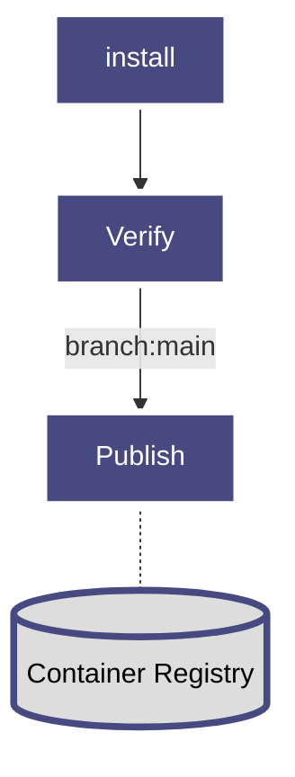
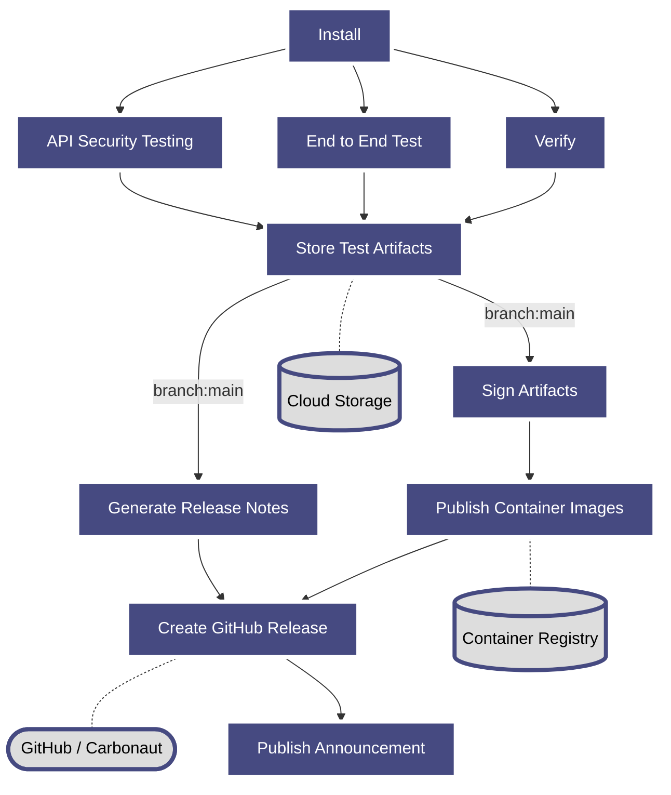

# Carbonaut CI/CD Doc

[CircleCI](https://app.circleci.com/pipelines/github/carbonaut-cloud/carbonaut?branch=main) is used as platform to run the CI/CD pipeline. The flowchart below illustrates how the pipeline runs.

## Current pipeline configuration

The CircleCI pipeline config can be found in the file `config.yml`

## WIP: planned pipeline configuration (as of 10/20/2022)

The current pipeline configuration mainly implements the verification part that insures that changes made to the project are well tested. Everything behind that, basically cutting the release and pushing artifacts, are not configured. The planned pipeline configuration shown below configures these phases too.

**Phases in short**
1. Install dependencies
2. Verify (build, linting, unit tests)
3. Advanced testing (end to end tests, penetration testing)
4. Push test artifacts 
5. Push signed container images
6. Cut release in GitHub
7. Announce new release

